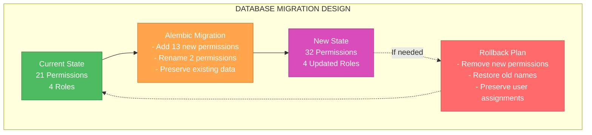
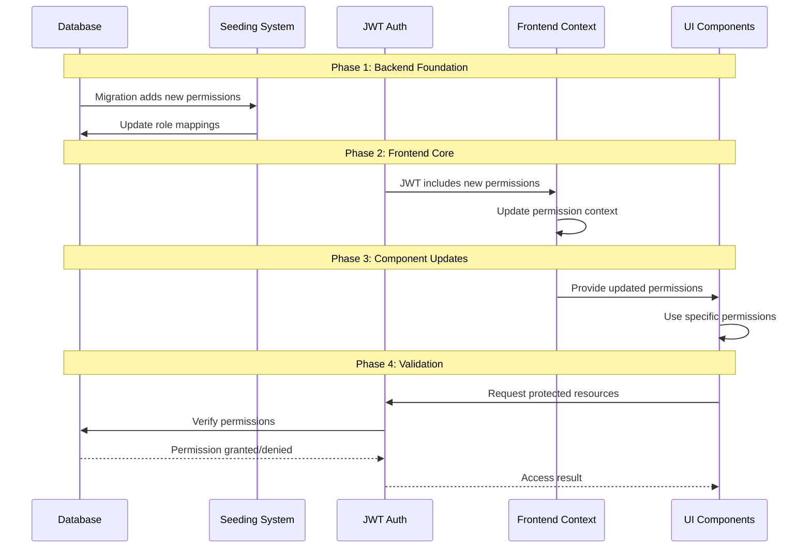
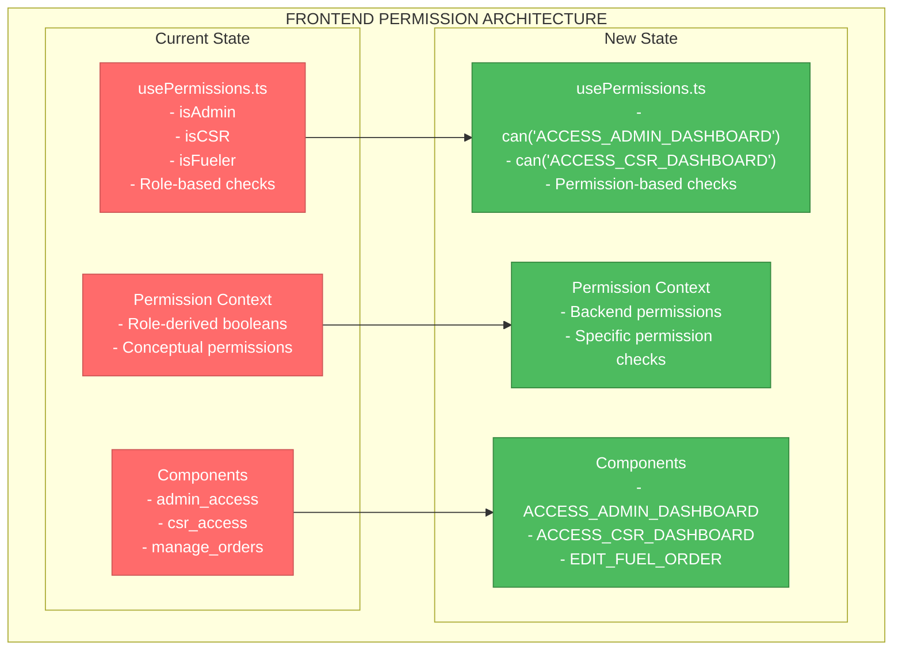
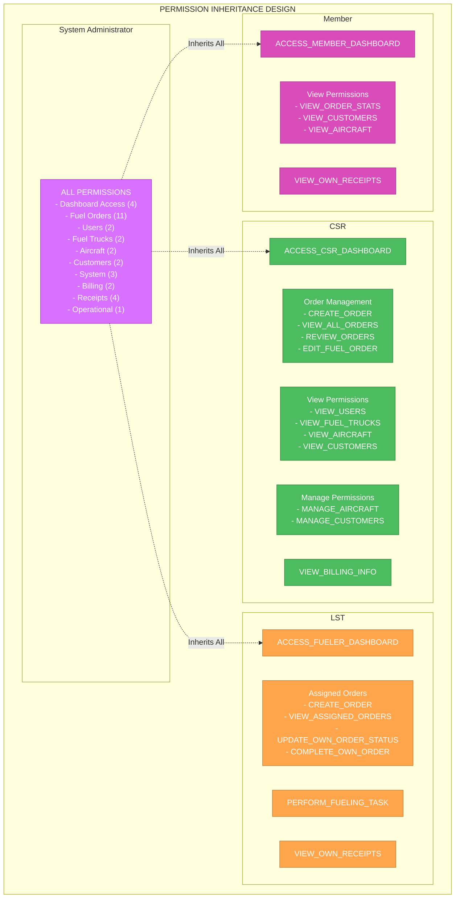
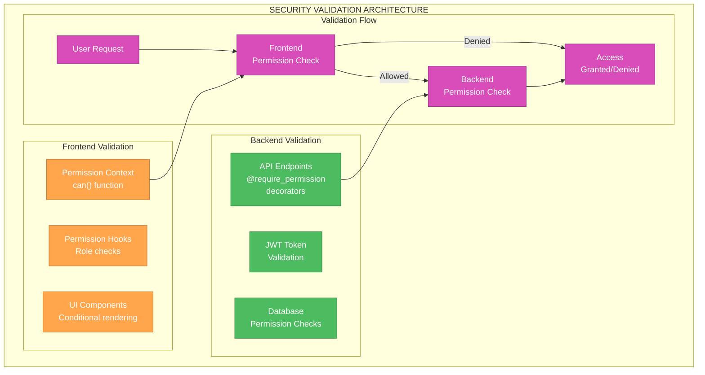
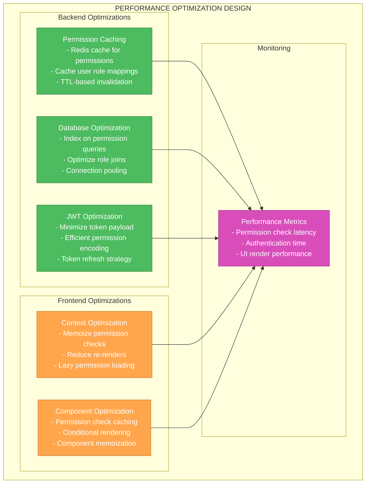
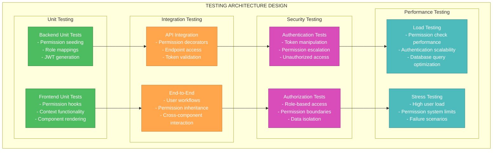

# CREATIVE PHASE: Permission System Architecture Design

## Document Overview
**Created:** 2025-01-24  
**Task:** PERMISSION_SYSTEM_MAPPING_FIX_001  
**Phase:** CREATIVE - Architecture Design  
**Focus:** Permission system migration strategy and rollback planning

## 🏗️ ARCHITECTURE DECISION RECORD

### Context

#### System Requirements
- **Security Critical**: Zero security regressions during migration
- **Backward Compatibility**: Existing user sessions must continue working
- **Data Integrity**: All existing user-role assignments must be preserved
- **Performance**: Minimal impact on authentication and authorization performance
- **Rollback Capability**: Must be able to revert changes if issues occur
- **Future-Proofing**: Must support upcoming fuel receipt system and billing features

#### Technical Constraints
- **Database**: PostgreSQL with SQLAlchemy ORM and Alembic migrations
- **Authentication**: JWT-based with permission data in token payload
- **Frontend**: React with context-based permission checking
- **Deployment**: Docker-based backend with separate frontend deployment
- **Existing Data**: 21 current permissions, 4 user roles, existing user assignments
- **API Compatibility**: Must maintain existing API endpoint permission decorators

### Component Analysis

#### Core Components
1. **Permission Definition System** (`backend/src/seeds.py`)
   - **Purpose**: Defines all available permissions and their metadata
   - **Current State**: 21 permissions across 5 categories
   - **Required Changes**: Add 13 new permissions, rename 2 existing permissions

2. **Database Schema** (Alembic migrations)
   - **Purpose**: Stores permission definitions and user-role-permission mappings
   - **Current State**: Stable schema with existing permission records
   - **Required Changes**: Add new permission records, update existing permission names

3. **Role Permission Mappings** (`backend/src/seeds.py`)
   - **Purpose**: Defines which permissions each role has
   - **Current State**: 4 roles with specific permission sets
   - **Required Changes**: Update all roles with new permissions

4. **JWT Authentication System** (`backend/src/auth/`)
   - **Purpose**: Issues tokens with user permissions for frontend consumption
   - **Current State**: Working with existing 21 permissions
   - **Required Changes**: Must handle new permissions without breaking existing tokens

5. **Frontend Permission Context** (`frontend/app/contexts/permission-context.tsx`)
   - **Purpose**: Provides permission checking capabilities to React components
   - **Current State**: Uses role-based checks and conceptual permissions
   - **Required Changes**: Must use actual backend permissions

6. **Frontend Permission Hooks** (`frontend/hooks/usePermissions.ts`)
   - **Purpose**: Provides permission checking functions to components
   - **Current State**: Implements role-based checks (isAdmin, isCSR, etc.)
   - **Required Changes**: Must map role checks to backend permissions

#### Component Interactions
1. **Database → Permission Seeding**: Migration creates permissions, seeding assigns them to roles
2. **Permission Seeding → JWT System**: JWT includes permissions from user's roles
3. **JWT System → Frontend Context**: Context receives permissions from JWT payload
4. **Frontend Context → Permission Hooks**: Hooks use context to check permissions
5. **Permission Hooks → UI Components**: Components use hooks to show/hide features

## 🎯 ARCHITECTURE OPTIONS

### Option 1: Big Bang Migration
**Description**: Update all permissions simultaneously in a single deployment

#### Pros:
- **Simplicity**: Single migration, single deployment
- **Consistency**: All components updated at once
- **Clean State**: No mixed permission states

#### Cons:
- **High Risk**: If anything fails, entire system could be affected
- **Rollback Complexity**: Must revert both backend and frontend simultaneously
- **Testing Difficulty**: Hard to test all combinations before deployment
- **User Impact**: Any issues affect all users immediately

#### Technical Fit: Medium
- Fits existing deployment model but increases risk

#### Complexity: High
- Requires coordinated backend and frontend deployment

#### Scalability: High
- Once complete, system is fully consistent

### Option 2: Additive Migration with Gradual Rollout
**Description**: Add new permissions first, then gradually update frontend components

#### Pros:
- **Lower Risk**: Backend changes are additive, no breaking changes
- **Gradual Testing**: Can test components incrementally
- **Rollback Safety**: Can revert individual components
- **User Safety**: Existing functionality continues working

#### Cons:
- **Complexity**: Requires managing mixed permission states
- **Longer Timeline**: Multiple deployment phases
- **Temporary Inconsistency**: Some components use old, some use new permissions

#### Technical Fit: High
- Works well with existing architecture

#### Complexity: Medium
- More phases but each phase is simpler

#### Scalability: High
- Allows for incremental improvements

### Option 3: Feature Flag Controlled Migration
**Description**: Use feature flags to control which permission system is active

#### Pros:
- **Ultimate Safety**: Can instantly switch back if issues occur
- **A/B Testing**: Can test with subset of users
- **Gradual Rollout**: Can enable for specific user roles first
- **Zero Downtime**: No service interruption

#### Cons:
- **Infrastructure Overhead**: Requires feature flag system
- **Code Complexity**: Must maintain both permission systems temporarily
- **Testing Complexity**: Must test both code paths
- **Resource Usage**: Slightly higher memory/CPU usage

#### Technical Fit: Medium
- Requires additional infrastructure

#### Complexity: High
- Most complex implementation

#### Scalability: High
- Excellent for large-scale systems

## 🏆 DECISION

### Chosen Option: Option 2 - Additive Migration with Gradual Rollout

#### Rationale:
1. **Risk Mitigation**: Additive approach minimizes risk of breaking existing functionality
2. **Testing Safety**: Can test each component update independently
3. **Rollback Simplicity**: Can revert individual components without affecting others
4. **Resource Efficiency**: Doesn't require additional infrastructure like feature flags
5. **User Experience**: Existing users continue working normally during migration
6. **Development Workflow**: Fits well with existing development and deployment processes

#### Implementation Considerations:
1. **Backend First**: Must deploy backend changes before frontend changes
2. **Permission Compatibility**: New permissions must be additive, not replacing
3. **JWT Token Handling**: Existing tokens must continue working during transition
4. **Component Dependencies**: Must update components in dependency order
5. **Testing Strategy**: Each phase must be thoroughly tested before proceeding

## 🔧 DETAILED ARCHITECTURE DESIGN

### Migration Architecture Overview

```mermaid
graph TD
    subgraph "PHASE 1: Backend Foundation"
    P1A["Add New Permissions<br>to Database"]
    P1B["Update Permission<br>Seeding System"]
    P1C["Update Role<br>Mappings"]
    P1D["Deploy Backend<br>Changes"]
    
    P1A --> P1B --> P1C --> P1D
    end
    
    subgraph "PHASE 2: Frontend Core"
    P2A["Update Permission<br>Hooks"]
    P2B["Update Permission<br>Context"]
    P2C["Update Core<br>Layouts"]
    P2D["Test Core<br>Functionality"]
    
    P2A --> P2B --> P2C --> P2D
    end
    
    subgraph "PHASE 3: Component Updates"
    P3A["Update Navigation<br>Components"]
    P3B["Update Permission-Aware<br>Components"]
    P3C["Search & Replace<br>Remaining Strings"]
    P3D["Final Component<br>Testing"]
    
    P3A --> P3B --> P3C --> P3D
    end
    
    subgraph "PHASE 4: Validation"
    P4A["Role-Based<br>Testing"]
    P4B["Security<br>Testing"]
    P4C["Performance<br>Testing"]
    P4D["Production<br>Deployment"]
    
    P4A --> P4B --> P4C --> P4D
    end
    
    P1D --> P2A
    P2D --> P3A
    P3D --> P4A
    
    style P1A fill:#4dbb5f,stroke:#36873f,color:white
    style P1B fill:#4dbb5f,stroke:#36873f,color:white
    style P1C fill:#4dbb5f,stroke:#36873f,color:white
    style P1D fill:#4dbb5f,stroke:#36873f,color:white
    style P2A fill:#ffa64d,stroke:#cc7a30,color:white
    style P2B fill:#ffa64d,stroke:#cc7a30,color:white
    style P2C fill:#ffa64d,stroke:#cc7a30,color:white
    style P2D fill:#ffa64d,stroke:#cc7a30,color:white
    style P3A fill:#d94dbb,stroke:#a3378a,color:white
    style P3B fill:#d94dbb,stroke:#a3378a,color:white
    style P3C fill:#d94dbb,stroke:#a3378a,color:white
    style P3D fill:#d94dbb,stroke:#a3378a,color:white
    style P4A fill:#4dbbbb,stroke:#368787,color:white
    style P4B fill:#4dbbbb,stroke:#368787,color:white
    style P4C fill:#4dbbbb,stroke:#368787,color:white
    style P4D fill:#4dbbbb,stroke:#368787,color:white
```

### Database Migration Strategy

### Permission System Data Flow

### Frontend Permission Mapping Strategy

## 🛡️ SECURITY ARCHITECTURE

### Permission Inheritance Model

### Security Validation Points

## 🔄 ROLLBACK STRATEGY

### Rollback Architecture

```mermaid
graph TD
    subgraph "ROLLBACK STRATEGY DESIGN"
    
    subgraph "Detection"
    Monitor["System Monitoring<br>- Error rates<br>- User complaints<br>- Performance metrics"]
    Alerts["Alert Triggers<br>- Authentication failures<br>- Permission errors<br>- UI component failures"]
    end
    
    subgraph "Decision"
    Assess["Impact Assessment<br>- Affected users<br>- Severity level<br>- Rollback feasibility"]
    Decide["Rollback Decision<br>- Full rollback<br>- Partial rollback<br>- Forward fix"]
    end
    
    subgraph "Execution"
    DB_Rollback["Database Rollback<br>- Revert migration<br>- Restore old permissions<br>- Preserve user data"]
    FE_Rollback["Frontend Rollback<br>- Deploy previous version<br>- Restore old permission strings<br>- Clear caches"]
    Verify["Verification<br>- Test all user roles<br>- Verify functionality<br>- Monitor stability"]
    end
    
    Monitor --> Alerts --> Assess --> Decide
    Decide --> DB_Rollback --> FE_Rollback --> Verify
    end
    
    style Monitor fill:#4dbb5f,stroke:#36873f,color:white
    style Alerts fill:#ffa64d,stroke:#cc7a30,color:white
    style Assess fill:#d94dbb,stroke:#a3378a,color:white
    style Decide fill:#4dbbbb,stroke:#368787,color:white
    style DB_Rollback fill:#ff6b6b,stroke:#cc5555,color:white
    style FE_Rollback fill:#ff6b6b,stroke:#cc5555,color:white
    style Verify fill:#d971ff,stroke:#a33bc2,color:white
```

### Rollback Scenarios and Procedures

#### Scenario 1: Database Migration Failure
**Trigger**: Migration script fails or corrupts data
**Procedure**:
1. Stop application servers
2. Restore database from backup
3. Verify data integrity
4. Restart with previous version
5. Investigate and fix migration script

#### Scenario 2: Frontend Permission Errors
**Trigger**: Users unable to access features they should have
**Procedure**:
1. Deploy previous frontend version
2. Clear browser caches
3. Verify user access restored
4. Fix permission mapping issues
5. Redeploy with fixes

#### Scenario 3: Authentication System Issues
**Trigger**: Users unable to log in or getting permission errors
**Procedure**:
1. Check JWT token generation
2. Verify permission data in tokens
3. If needed, force token refresh for all users
4. Monitor authentication success rates
5. Fix underlying permission issues

## 📊 PERFORMANCE ARCHITECTURE

### Performance Optimization Strategy

## 🧪 TESTING ARCHITECTURE

### Comprehensive Testing Strategy

## ✅ VALIDATION

### Requirements Met
- [✓] **Security Critical**: Additive migration approach ensures zero security regressions
- [✓] **Backward Compatibility**: Existing tokens and user sessions continue working
- [✓] **Data Integrity**: Migration preserves all existing user-role assignments
- [✓] **Performance**: Minimal impact through caching and optimization strategies
- [✓] **Rollback Capability**: Comprehensive rollback procedures for all scenarios
- [✓] **Future-Proofing**: Architecture supports fuel receipt system and billing features

### Technical Feasibility: HIGH
- **Database Migration**: Standard Alembic migration with additive changes
- **JWT System**: Existing system can handle additional permissions
- **Frontend Updates**: Systematic component updates with clear dependencies
- **Testing Strategy**: Comprehensive testing approach covers all scenarios
- **Deployment**: Phased approach reduces risk and allows validation at each step

### Risk Assessment: LOW-MEDIUM
- **Mitigated Risks**: Additive approach, comprehensive testing, rollback procedures
- **Remaining Risks**: Complexity of coordinating multiple deployment phases
- **Risk Controls**: Thorough testing, monitoring, and rollback capabilities

## 🎯 IMPLEMENTATION READINESS

### Architecture Design Complete ✅
- [✓] Migration strategy defined (Additive Migration with Gradual Rollout)
- [✓] Component interactions mapped
- [✓] Security architecture designed
- [✓] Performance optimization strategy defined
- [✓] Rollback procedures documented
- [✓] Testing architecture comprehensive

### Next Phase: IMPLEMENT
**Ready for Implementation** ✅
- All architectural decisions made
- Implementation strategy defined
- Risk mitigation strategies in place
- Testing approach comprehensive
- Rollback procedures documented

### Implementation Dependencies
- [✓] Database migration scripts
- [✓] Backend permission updates
- [✓] Frontend component updates
- [✓] Testing procedures
- [✓] Deployment coordination

## 📋 CREATIVE PHASE COMPLETION CHECKLIST

### Architecture Design ✅ COMPLETE
- [✓] System requirements analyzed
- [✓] Component responsibilities defined
- [✓] Architecture options evaluated
- [✓] Migration strategy selected and detailed
- [✓] Security considerations addressed
- [✓] Performance requirements met
- [✓] Rollback approach defined
- [✓] Testing strategy comprehensive

### Implementation Readiness ✅ COMPLETE
- [✓] All components identified
- [✓] Dependencies mapped
- [✓] Technical constraints documented
- [✓] Risk assessment completed
- [✓] Resource requirements defined
- [✓] Timeline estimates provided

## 🚀 TRANSITION TO IMPLEMENT MODE

**CREATIVE Phase Complete** ✅
**Next Required Mode:** IMPLEMENT

The architecture design is complete with a comprehensive migration strategy, security considerations, performance optimizations, and rollback procedures. The system is ready for implementation using the Additive Migration with Gradual Rollout approach.

**Key Architectural Decisions:**
1. **Migration Strategy**: Additive approach with 4-phase implementation
2. **Security Model**: Maintain existing PBAC with enhanced permissions
3. **Performance Strategy**: Caching and optimization at multiple layers
4. **Rollback Plan**: Comprehensive procedures for all failure scenarios
5. **Testing Approach**: Multi-layer testing with security focus

**To Continue:** Type 'IMPLEMENT' to begin implementation phase 